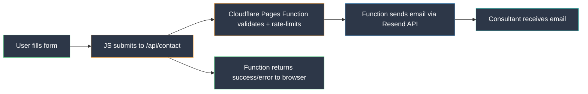

# Portfolio Website — Technical Architecture Plan

> **Target**: IT Consultant portfolio site  
> **Domain**: Existing `.it` FQDN  
> **Hosting**: Cloudflare Pages (free tier)  
> **Languages**: Italian (primary) + English  
> **Design**: Modern, minimal, clean — accessible to non-technical audiences  
> **Primary goal**: Showcase work & skills | **Secondary**: Blog  
> **Monthly cost**: €0  

---

## 1. Stack Comparison & Recommendation

| Criteria | Jamstack - Hugo + Cloudflare Pages | Traditional - LAMP/LEMP on VM | Traditional Hosting - Aruba |
|---|---|---|---|
| **Cost** | Free | ~€5-15/mo for a VPS | ~€25-50/yr shared hosting |
| **Performance** | ⭐⭐⭐⭐⭐ Static files on global CDN 300+ PoPs | ⭐⭐⭐ Depends on server config | ⭐⭐ Shared resources, no CDN |
| **Security** | ⭐⭐⭐⭐⭐ No server-side attack surface + native WAF | ⭐⭐ Must patch OS, PHP, DB | ⭐⭐ Managed but limited control |
| **Maintenance** | Near-zero: no OS, no DB, no runtime | High: updates, backups, monitoring | Medium: cPanel-based management |
| **Scalability** | Infinite - CDN-backed static | Manual scaling required | Limited by plan |
| **CI/CD** | Built-in: push to GitHub → auto-build → deploy | Must configure manually | FTP/SFTP based, no CI/CD |
| **i18n support** | Built-in - Hugo multilingual | Custom code required | Custom code required |
| **SSL** | Free, automatic via Cloudflare | Let's Encrypt - manual renewal | Often included but basic |

### ✅ Recommendation: **Hugo + Cloudflare Pages**

**Why Hugo specifically over Jekyll?**
- Build speed: Hugo builds in milliseconds vs seconds for Jekyll
- Single binary: no Ruby dependency chain
- Native multilingual support with content directory per language
- Built-in image processing pipeline
- Active development and large theme ecosystem

**Why Cloudflare Pages over GitHub Pages?**
- Simpler architecture: no GitHub Actions needed, Cloudflare auto-builds Hugo
- Everything in one dashboard: CDN, WAF, DNS, hosting, analytics, serverless functions
- Unlimited bandwidth (vs 100 GB/month on GitHub Pages)
- Preview deployments for every branch/PR
- Contact form as a Pages Function (same repo, same deploy)
- One-click rollback in dashboard
- No double-proxy complexity

---

## 2. Site Structure & Pages

```
Homepage (/)
├── Hero section — name, title, tagline, CTA
├── About — brief bio, photo, key skills
├── Services — what you offer as cards or grid
├── Projects — featured portfolio items 3-5
├── Testimonials — optional social proof
├── Contact — form + social links
└── Footer — copyright, privacy, language switcher

Projects section (/projects/ or /progetti/)
├── Project detail page - one per project
└── Project list/grid page

Blog (/blog/)
├── Post list page
└── Individual post pages

Legal
├── Privacy Policy (/privacy/)
└── Cookie Policy (/cookie-policy/)
```

Each page is available in both `/it/` and `/en/` prefixes via Hugo's i18n system.

---

## 3. Folder Structure

```
portfolio/
├── functions/
│   └── api/
│       └── contact.js              # Cloudflare Pages Function (contact form)
├── archetypes/
│   └── default.md                  # Template for new content
├── assets/
│   ├── css/
│   │   └── main.css                # Tailwind or custom CSS
│   ├── js/
│   │   └── main.js                 # Minimal JS (form, animations)
│   └── images/
│       ├── profile.webp            # Optimized profile photo
│       ├── og-image.png            # OpenGraph fallback image
│       └── projects/               # Project screenshots/images
├── content/
│   ├── it/                         # Italian content
│   │   ├── _index.md               # Homepage content
│   │   ├── projects/
│   │   │   ├── _index.md           # Projects list page
│   │   │   ├── project-alpha.md
│   │   │   └── project-beta.md
│   │   ├── blog/
│   │   │   ├── _index.md
│   │   │   └── primo-post.md
│   │   ├── privacy.md
│   │   └── cookie-policy.md
│   └── en/                         # English content
│       ├── _index.md
│       ├── projects/
│       │   ├── _index.md
│       │   ├── project-alpha.md
│       │   └── project-beta.md
│       ├── blog/
│       │   ├── _index.md
│       │   └── first-post.md
│       ├── privacy.md
│       └── cookie-policy.md
├── data/
│   ├── skills.yaml                 # Skills data (reusable)
│   ├── services.yaml               # Services offered
│   └── social.yaml                 # Social links
├── i18n/
│   ├── it.yaml                     # Italian UI translations
│   └── en.yaml                     # English UI translations
├── layouts/
│   ├── _default/
│   │   ├── baseof.html             # Base template
│   │   ├── list.html               # List pages
│   │   └── single.html             # Single content pages
│   ├── partials/
│   │   ├── head.html               # <head> with SEO meta
│   │   ├── header.html             # Navigation
│   │   ├── footer.html             # Footer
│   │   ├── seo.html                # OpenGraph + JSON-LD
│   │   ├── contact-form.html       # Contact form partial
│   │   └── language-switcher.html  # IT/EN toggle
│   ├── projects/
│   │   ├── list.html               # Projects grid
│   │   └── single.html             # Project detail
│   ├── blog/
│   │   ├── list.html               # Blog post list
│   │   └── single.html             # Blog post
│   └── index.html                  # Homepage template
├── static/
│   ├── favicon.ico
│   ├── favicon.svg
│   ├── site.webmanifest
│   ├── robots.txt
│   ├── _headers                    # Cloudflare Pages headers config
│   └── _redirects                  # Cloudflare Pages redirect rules
├── hugo.toml                       # Hugo configuration
├── tailwind.config.js              # If using Tailwind CSS
├── package.json                    # Node deps (Tailwind, PostCSS)
├── wrangler.toml                   # Cloudflare Pages Functions config
└── README.md
```

### Content Management via Markdown

Each project file follows this frontmatter pattern:

```yaml
---
title: "Cloud Migration for Acme Corp"
date: 2025-06-15
draft: false
tags: ["aws", "terraform", "migration"]
categories: ["cloud"]
summary: "Migrated 50+ services from on-premise to AWS"
image: "projects/acme-migration.webp"
client: "Acme Corp"
technologies: ["AWS", "Terraform", "Docker", "GitHub Actions"]
duration: "6 months"
weight: 1  # Controls display order
---

Full project description in Markdown...
```

---

## 4. Data Flow: From Editor to Browser


### Flow Description

1. **Author** — Write/edit Markdown files locally in VS Code
2. **Commit and Push** — `git push` to `main` branch on GitHub
3. **Auto-detect** — Cloudflare Pages webhook detects the push
4. **Build and Deploy** — Cloudflare runs `hugo --minify` and deploys the output
5. **Serve** — Static files served from Cloudflare's global CDN with WAF, caching, SSL
6. **Delivery** — User receives fast, cached, secure response

### Preview Deployment Flow


### Contact Form Flow



**Why Cloudflare Pages Functions for the contact form?**
- Lives in the same repo under `/functions/api/contact.js`
- Deploys automatically with the site
- Free tier: 100,000 requests/day
- No cold starts (runs on Cloudflare edge)
- Built-in rate limiting via Cloudflare
- Full control over validation and spam filtering

---

## 5. CI/CD: Cloudflare Pages Auto-Deploy

Unlike GitHub Pages which requires a GitHub Actions workflow, **Cloudflare Pages handles everything automatically**:

### Setup (one-time in Cloudflare Dashboard)

1. Go to **Cloudflare Dashboard → Pages → Create a project**
2. Connect your GitHub repository
3. Configure build settings:

| Setting | Value |
|---|---|
| **Production branch** | `main` |
| **Build command** | `hugo --minify` |
| **Build output directory** | `public` |
| **Root directory** | `/` (project root) |
| **Hugo version** | Set via environment variable `HUGO_VERSION=0.145.0` |

### Environment Variables

| Variable | Value | Purpose |
|---|---|---|
| `HUGO_VERSION` | `0.145.0` | Pin Hugo version for reproducible builds |
| `NODE_VERSION` | `20` | For Tailwind CSS compilation |
| `RESEND_API_KEY` | `re_xxxxx` | For contact form email sending (encrypted) |
| `CONTACT_EMAIL` | `you@yourdomain.it` | Destination for contact form (encrypted) |

### What Happens on Every Push

1. Push to `main` → **production deployment** at `yourdomain.it`
2. Push to any other branch → **preview deployment** at `<commit-hash>.yourdomain.pages.dev`
3. Build logs visible in Cloudflare Dashboard
4. One-click rollback to any previous deployment

### Optional: GitHub Actions for Quality Checks

Even though Cloudflare handles deployment, you can optionally add a lightweight GitHub Actions workflow for pre-merge checks:

```yaml
# .github/workflows/check.yml
name: Quality Check

on:
  pull_request:
    branches: [main]

jobs:
  check:
    runs-on: ubuntu-latest
    steps:
      - uses: actions/checkout@v4
      - name: Setup Hugo
        uses: peaceiris/actions-hugo@v3
        with:
          hugo-version: latest
          extended: true
      - name: Build test
        run: hugo --minify
      - name: Check links
        uses: lycheeverse/lychee-action@v2
        with:
          args: --verbose ./public
```

This runs on PRs only and verifies the build succeeds and all links are valid before merging.

---

## 6. Cloudflare Integration

### 6.1 DNS Configuration Checklist

Since the site is hosted on Cloudflare Pages, DNS setup is simpler:

| # | Record Type | Name | Value | Proxy | Notes |
|---|---|---|---|---|---|
| 1 | `CNAME` | `@` | `your-project.pages.dev` | ☁️ Proxied | Points apex domain to Cloudflare Pages |
| 2 | `CNAME` | `www` | `your-project.pages.dev` | ☁️ Proxied | www subdomain |
| 3 | `TXT` | `@` | `v=spf1 include:_spf.google.com ~all` | — | SPF for email if using Google Workspace |
| 4 | `TXT` | `_dmarc` | `v=DMARC1; p=quarantine; rua=mailto:...` | — | DMARC policy |
| 5 | `MX` | `@` | Your email provider MX records | — | Email delivery |

> **Note**: With Cloudflare Pages, you add the custom domain directly in the Pages project settings. Cloudflare automatically configures the CNAME. No A/AAAA records needed.

### Steps to Configure Custom Domain

1. In Cloudflare Dashboard → Pages → your project → **Custom domains**
2. Add `yourdomain.it`
3. Add `www.yourdomain.it`
4. Cloudflare auto-creates DNS records and provisions SSL
5. Set up a redirect rule: `www.yourdomain.it` → `yourdomain.it` (or vice versa)

### 6.2 SSL/TLS Configuration

- **SSL Mode**: Full (Strict) — automatic with Cloudflare Pages
- **Always Use HTTPS**: Enabled
- **Minimum TLS Version**: TLS 1.2
- **Automatic HTTPS Rewrites**: Enabled
- **HSTS**: Enabled with max-age 6 months, include subdomains

### 6.3 Caching Strategy

Cloudflare Pages automatically handles caching for static assets. Additional tuning:

| Setting | Value | Rationale |
|---|---|---|
| **Browser Cache TTL** | 4 hours for HTML | Balance between freshness and performance |
| **Static assets** | 1 year (auto-handled by Pages) | CSS/JS/images with content hashing |
| **Always Online** | Enabled | Serve stale content if build fails |

**Custom caching via `_headers` file** (in `/static/_headers`):

```
/*
  Cache-Control: public, max-age=0, must-revalidate

/assets/*
  Cache-Control: public, max-age=31536000, immutable

/*.css
  Cache-Control: public, max-age=31536000, immutable

/*.js
  Cache-Control: public, max-age=31536000, immutable

/*.woff2
  Cache-Control: public, max-age=31536000, immutable

/images/*
  Cache-Control: public, max-age=2592000
```

### 6.4 WAF & Security

- **Security Level**: Medium
- **Bot Fight Mode**: Enabled
- **Challenge Passage**: 30 minutes
- **Browser Integrity Check**: Enabled
- **Hotlink Protection**: Enabled (prevent image theft)
- **Email Address Obfuscation**: Enabled

### 6.5 Performance Features

- **Auto Minify**: HTML, CSS, JS (backup to Hugo's minification)
- **Brotli Compression**: Enabled
- **Early Hints**: Enabled (103 responses)
- **HTTP/2**: Enabled (automatic)
- **HTTP/3 with QUIC**: Enabled

### 6.6 Redirect Rules (via `_redirects` file)

```
# Redirect www to apex
https://www.yourdomain.it/* https://yourdomain.it/:splat 301

# Default language redirect
/ /it/ 302

# Old URL patterns (if migrating from another site)
# /old-path /it/new-path 301
```

---

## 7. SEO & Metadata

### 7.1 OpenGraph Tags (per page)

```html
<!-- Primary Meta Tags -->
<meta name="title" content="Dani — IT Consultant | Cloud and DevOps">
<meta name="description" content="IT Consultant specializing in cloud architecture, DevOps, and infrastructure automation.">

<!-- Open Graph / Facebook -->
<meta property="og:type" content="website">
<meta property="og:url" content="https://yourdomain.it/">
<meta property="og:title" content="Dani — IT Consultant">
<meta property="og:description" content="IT Consultant specializing in cloud architecture...">
<meta property="og:image" content="https://yourdomain.it/og-image.png">
<meta property="og:locale" content="it_IT">
<meta property="og:locale:alternate" content="en_US">

<!-- Twitter -->
<meta property="twitter:card" content="summary_large_image">
<meta property="twitter:url" content="https://yourdomain.it/">
<meta property="twitter:title" content="Dani — IT Consultant">
<meta property="twitter:description" content="IT Consultant specializing in cloud architecture...">
<meta property="twitter:image" content="https://yourdomain.it/og-image.png">
```

### 7.2 JSON-LD Schema.org (Homepage)

```json
{
  "@context": "https://schema.org",
  "@type": "ProfessionalService",
  "name": "Dani — IT Consulting",
  "url": "https://yourdomain.it",
  "logo": "https://yourdomain.it/logo.svg",
  "image": "https://yourdomain.it/og-image.png",
  "description": "IT Consultant specializing in cloud architecture, DevOps, and infrastructure automation",
  "address": {
    "@type": "PostalAddress",
    "addressLocality": "City",
    "addressCountry": "IT"
  },
  "sameAs": [
    "https://linkedin.com/in/yourprofile",
    "https://github.com/yourprofile"
  ],
  "founder": {
    "@type": "Person",
    "name": "Dani",
    "jobTitle": "IT Consultant",
    "url": "https://yourdomain.it",
    "sameAs": [
      "https://linkedin.com/in/yourprofile",
      "https://github.com/yourprofile"
    ]
  },
  "knowsAbout": [
    "Cloud Architecture",
    "DevOps",
    "Infrastructure Automation",
    "AWS",
    "Terraform"
  ]
}
```

### 7.3 JSON-LD for Blog Posts

```json
{
  "@context": "https://schema.org",
  "@type": "BlogPosting",
  "headline": "Post Title",
  "datePublished": "2025-06-15",
  "dateModified": "2025-06-20",
  "author": {
    "@type": "Person",
    "name": "Dani"
  },
  "publisher": {
    "@type": "Organization",
    "name": "Dani — IT Consulting",
    "logo": {
      "@type": "ImageObject",
      "url": "https://yourdomain.it/logo.svg"
    }
  },
  "description": "Post summary here",
  "mainEntityOfPage": {
    "@type": "WebPage",
    "@id": "https://yourdomain.it/it/blog/post-slug/"
  }
}
```

### 7.4 Additional SEO Requirements

- **Canonical URLs**: Set on every page via `<link rel="canonical">`
- **Hreflang tags**: For IT/EN language alternates
- **Sitemap**: Auto-generated by Hugo at `/sitemap.xml`
- **robots.txt**: Allow all, reference sitemap
- **Structured breadcrumbs**: JSON-LD BreadcrumbList on inner pages
- **Page speed**: Target Lighthouse score 95+ on all metrics

```html
<!-- Hreflang example -->
<link rel="alternate" hreflang="it" href="https://yourdomain.it/it/">
<link rel="alternate" hreflang="en" href="https://yourdomain.it/en/">
<link rel="alternate" hreflang="x-default" href="https://yourdomain.it/it/">
```

---

## 8. Font & Asset Optimization Strategy

### 8.1 Page Weight Budget: under 500KB

| Asset Type | Budget | Strategy |
|---|---|---|
| **HTML** | under 30KB | Hugo minification, brotli compression |
| **CSS** | under 15KB | Tailwind with purge, or hand-written minimal CSS |
| **JavaScript** | under 10KB | Vanilla JS only, no frameworks |
| **Fonts** | under 50KB | 1 font family, 2 weights max, WOFF2 only |
| **Images** | under 350KB | WebP, lazy loading, responsive srcset |
| **SVG icons** | under 10KB | Inline SVG sprite or individual inline |
| **Total** | **under 465KB** | Leaves ~35KB headroom |

### 8.2 Font Strategy

**Recommended approach: System font stack + 1 accent font**

```css
/* System font stack for body text — zero download cost */
body {
  font-family: -apple-system, BlinkMacSystemFont, "Segoe UI", Roboto,
               "Helvetica Neue", Arial, "Noto Sans", sans-serif;
}

/* Single accent font for headings — self-hosted, WOFF2 only */
/* Recommendation: Inter variable font or DM Sans */
@font-face {
  font-family: "Inter";
  src: url("/fonts/inter-var-latin.woff2") format("woff2");
  font-weight: 100 900;
  font-display: swap;
  unicode-range: U+0000-00FF, U+0131, U+0152-0153, U+02BB-02BC, U+2000-206F;
}

h1, h2, h3 {
  font-family: "Inter", sans-serif;
}
```

**Why this approach?**
- System fonts: 0KB download, instant rendering
- Single variable font file: ~25KB for all weights
- `font-display: swap`: no FOIT (Flash of Invisible Text)
- `unicode-range`: only download Latin subset
- Self-hosted: no Google Fonts privacy/GDPR concerns

### 8.3 Image Optimization

| Technique | Implementation |
|---|---|
| **Format** | WebP for photos, SVG for icons/logos |
| **Responsive** | Hugo image processing: resize and convert to webp |
| **Lazy loading** | `loading="lazy"` on all below-fold images |
| **Dimensions** | Always set `width` and `height` to prevent CLS |
| **Profile photo** | Max 400x400px, WebP, ~20-30KB |
| **Project thumbnails** | Max 800x450px, WebP, ~40-60KB each |
| **OG Image** | 1200x630px PNG (only loaded by social crawlers) |

### 8.4 SVG Icon Strategy

Use inline SVGs for icons (no icon font libraries):

```html
<!-- Inline SVG — no HTTP request, CSS-stylable -->
<svg class="icon" viewBox="0 0 24 24" fill="none" stroke="currentColor">
  <path d="M..."/>
</svg>
```

Benefits: zero additional requests, CSS color control, tiny file size (~200-500 bytes each).

---

## 9. Monitoring Strategy

### 9.1 Privacy-Friendly Analytics

**Recommended: Cloudflare Web Analytics (Free)**

- No cookies, no tracking scripts that require consent
- GDPR compliant out of the box
- Integrated into Cloudflare dashboard
- Metrics: page views, visits, top pages, countries, devices
- No impact on page weight (loaded async from Cloudflare edge)

**Alternative: Plausible Analytics or Umami (self-hosted)**

If more detailed analytics are needed:
- Plausible: ~1KB script, cookie-free, EU-hosted option (~€9/mo)
- Umami: self-hosted, free, cookie-free (requires a server)

### 9.2 Uptime & Performance Monitoring

| Tool | Purpose | Cost |
|---|---|---|
| **Cloudflare Analytics** | Traffic, cache hit ratio, threats blocked | Free |
| **Cloudflare Web Analytics** | Page views, visitors, Core Web Vitals | Free |
| **Cloudflare Pages Logs** | Build logs, deployment history | Free |
| **UptimeRobot** | Uptime monitoring, alerts | Free (50 monitors) |
| **Google Search Console** | SEO performance, indexing issues | Free |
| **PageSpeed Insights** | Periodic Lighthouse audits | Free |

### 9.3 Alerting

- **UptimeRobot**: Email/Telegram alert if site is down for more than 1 minute
- **Cloudflare Pages**: Build failure notifications via email
- **Cloudflare**: Security event notifications (DDoS, WAF triggers)

---

## 10. Hugo Configuration Overview

```toml
# hugo.toml
baseURL = "https://yourdomain.it/"
defaultContentLanguage = "it"
defaultContentLanguageInSubdir = true

[languages]
  [languages.it]
    languageName = "Italiano"
    weight = 1
    title = "Dani — Consulente IT"
  [languages.en]
    languageName = "English"
    weight = 2
    title = "Dani — IT Consultant"

[markup]
  [markup.goldmark]
    [markup.goldmark.renderer]
      unsafe = false
  [markup.highlight]
    style = "monokai"

[outputs]
  home = ["HTML", "RSS", "JSON"]

[sitemap]
  changefreq = "weekly"
  priority = 0.5

[params]
  description = "IT Consultant — Cloud, DevOps, Infrastructure"
  author = "Dani"
  ogImage = "/og-image.png"

[minify]
  [minify.tdewolff]
    [minify.tdewolff.html]
      keepWhitespace = false
    [minify.tdewolff.css]
      keepCSS2 = true
```

---

## 11. Security Headers

Configured via the `_headers` file in `/static/_headers` (Cloudflare Pages native):

```
/*
  X-Content-Type-Options: nosniff
  X-Frame-Options: DENY
  Referrer-Policy: strict-origin-when-cross-origin
  Permissions-Policy: camera=(), microphone=(), geolocation=()
  Content-Security-Policy: default-src 'self'; script-src 'self' static.cloudflareinsights.com; style-src 'self' 'unsafe-inline'; img-src 'self' data:; font-src 'self'; connect-src 'self'; frame-ancestors 'none'
```

No Cloudflare Transform Rules needed — the `_headers` file is natively supported by Cloudflare Pages.

---

## 12. Contact Form: Cloudflare Pages Function

The contact form backend lives in the same repository:

```
functions/
└── api/
    └── contact.js
```

### Function Logic

```javascript
// functions/api/contact.js
export async function onRequestPost(context) {
  const { request, env } = context;

  // 1. Parse form data
  const body = await request.json();
  const { name, email, message, lang } = body;

  // 2. Validate inputs
  if (!name || !email || !message) {
    return new Response(JSON.stringify({ error: "Missing fields" }), {
      status: 400,
      headers: { "Content-Type": "application/json" }
    });
  }

  // 3. Basic spam check (honeypot field)
  if (body.website) {
    return new Response(JSON.stringify({ ok: true }), { status: 200 });
  }

  // 4. Send email via Resend API
  const res = await fetch("https://api.resend.com/emails", {
    method: "POST",
    headers: {
      Authorization: `Bearer ${env.RESEND_API_KEY}`,
      "Content-Type": "application/json"
    },
    body: JSON.stringify({
      from: "Portfolio Contact <noreply@yourdomain.it>",
      to: env.CONTACT_EMAIL,
      subject: `New contact from ${name}`,
      text: `Name: ${name}\nEmail: ${email}\n\n${message}`
    })
  });

  if (res.ok) {
    return new Response(JSON.stringify({ ok: true }), {
      status: 200,
      headers: { "Content-Type": "application/json" }
    });
  }

  return new Response(JSON.stringify({ error: "Failed to send" }), {
    status: 500,
    headers: { "Content-Type": "application/json" }
  });
}
```

**Resend** (resend.com) free tier: 3,000 emails/month — more than enough for a portfolio contact form.

---

## 13. Implementation Phases

### Phase 1 — Foundation
- [ ] Initialize Hugo project with folder structure
- [ ] Configure `hugo.toml` with bilingual setup
- [ ] Set up Tailwind CSS (or minimal custom CSS)
- [ ] Create base templates: baseof.html, head.html, header.html, footer.html
- [ ] Implement language switcher component
- [ ] Set up GitHub repository
- [ ] Connect repository to Cloudflare Pages

### Phase 2 — Core Pages
- [ ] Build homepage layout: hero, about, services, projects, contact sections
- [ ] Create project list and detail templates
- [ ] Write content for 3-5 initial projects in IT + EN
- [ ] Implement responsive navigation
- [ ] Add SEO partial with OpenGraph + JSON-LD

### Phase 3 — Contact & Blog
- [ ] Create Cloudflare Pages Function for contact form
- [ ] Build contact form with client-side validation and honeypot
- [ ] Set up Resend account and configure API key
- [ ] Create blog list and post templates
- [ ] Write 1-2 initial blog posts (optional at launch)

### Phase 4 — Optimization & Deploy
- [ ] Optimize all images to WebP with responsive srcset
- [ ] Self-host font files (Inter or DM Sans)
- [ ] Configure `_headers` file for security and caching
- [ ] Configure `_redirects` file for www and language redirects
- [ ] Run Lighthouse audit, fix any issues
- [ ] Verify page weight under 500KB

### Phase 5 — DNS & Cloudflare
- [ ] Add domain to Cloudflare (transfer nameservers or add as CNAME setup)
- [ ] Add custom domain to Cloudflare Pages project
- [ ] Verify SSL Full Strict is active
- [ ] Enable WAF, Bot Fight Mode, security features
- [ ] Enable Cloudflare Web Analytics

### Phase 6 — Launch & Monitor
- [ ] Submit sitemap to Google Search Console
- [ ] Set up UptimeRobot monitoring
- [ ] Verify hreflang and canonical tags
- [ ] Test contact form end-to-end
- [ ] Final cross-browser and mobile testing
- [ ] Announce launch

---

## Summary

| Aspect | Choice |
|---|---|
| **SSG** | Hugo (extended) |
| **Hosting** | Cloudflare Pages (free tier) |
| **CDN + Security** | Cloudflare (native — same platform) |
| **CSS** | Tailwind CSS (purged) or minimal custom |
| **JS** | Vanilla JS, under 10KB |
| **Fonts** | System stack + 1 self-hosted variable font |
| **Images** | WebP, lazy-loaded, Hugo-processed |
| **Contact Form** | Cloudflare Pages Function + Resend API |
| **Analytics** | Cloudflare Web Analytics (cookie-free) |
| **CI/CD** | Cloudflare Pages auto-build on push |
| **i18n** | Hugo native multilingual IT/EN |
| **SEO** | OpenGraph, JSON-LD, hreflang, sitemap |
| **Target weight** | Under 500KB per page |
| **Target Lighthouse** | 95+ all categories |
| **Monthly cost** | **€0** |
